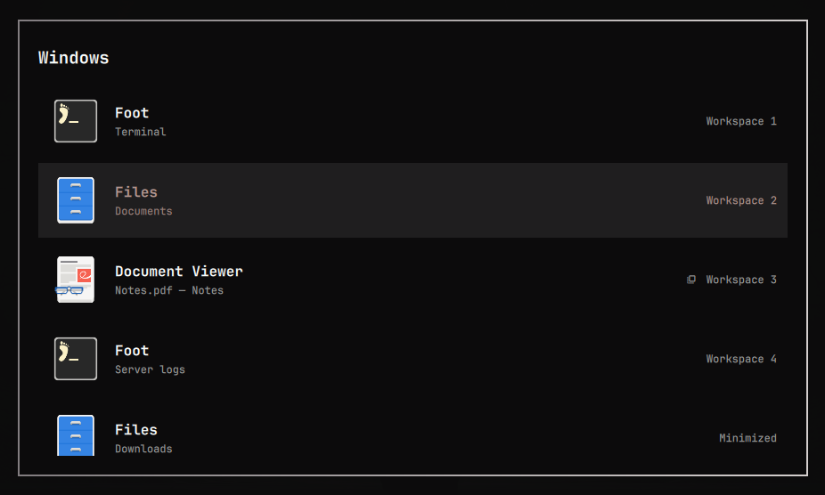
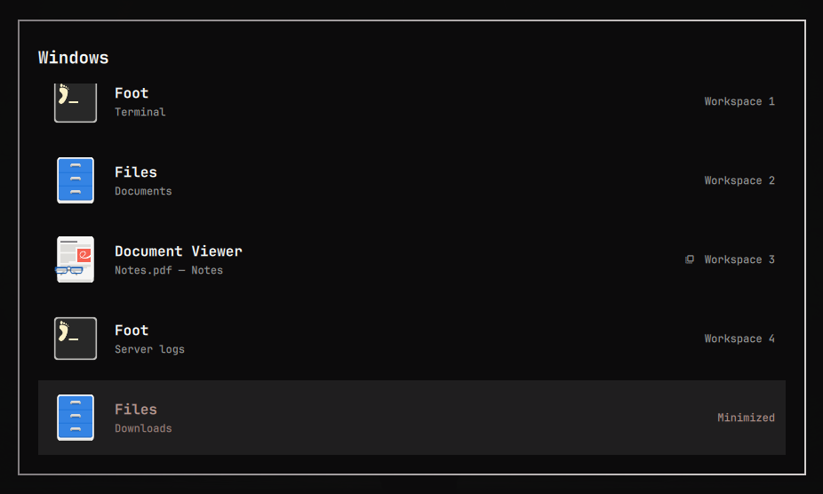
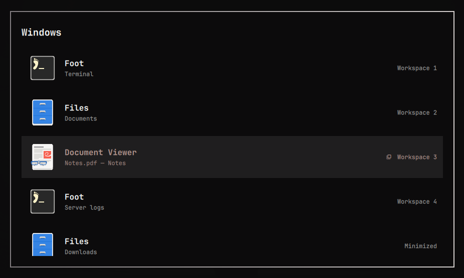

# Autitabi

A visual Alt+Tab window switcher for [Hyprland](https://hyprland.org/), built
with [Quickshell](https://quickshell.org/).

It shows every open window across all workspaces in a single overlay, ordered by
recency, and lets you pick one with the keyboard or the mouse. Minimized windows
come back to the workspace they were minimized from.



**Support scope (0.1.0):** the switcher runs as an
[Omarchy](https://omarchy.org/) Shell plugin. That is the only supported host
today. The list logic and the Hyprland Lua are already host-agnostic and the
QML's theme surface is isolated, so a Quickshell-standalone build is a small
step away — but it is not implemented or tested yet. See
[Standalone](#standalone-hyprland--quickshell-not-yet-supported).

---

## Screenshots

Minimized windows stay in the list with a **Minimized** tag; selecting one sends
it back to the workspace it came from.



Step through the list with Tab, the arrow keys or the mouse — the selection and
its workspace tag follow along.



---

## Features

- **All workspaces** in one list — not just the current one.
- **MRU ordering** by `focusHistoryID`; opens pre-selected on the previous window.
- **Workspace labels** on every row (`Workspace 3`, named workspaces, `Minimized`).
- **Minimized windows** are listed and **restored to their original workspace**.
- **Hyprland groups** — background tabs are listed and the right tab is raised
  on select.
- **Pinned windows** are listed.
- **Mouse + keyboard** — Tab / arrows / hover / click, Enter to activate,
  Escape to cancel, release Alt to activate.
- **Reverse open** — `Alt+Shift+Tab` opens moving backwards, no need to open
  forwards first.
- **Windows identified by address**, so multiple windows of the same app (even
  with the same title) are handled correctly.
- **Theme-aware** — follows the active Omarchy theme.
- **No polling** — `hyprctl clients` is read once per open; navigation and
  activation are in-process (no subprocess per keypress).

## Requirements

- **Hyprland >= 0.56** — Lua config (`hl.*` API), GlobalShortcuts
  (`hl.dsp.global`), window tags, window groups.
- **Quickshell** with Hyprland support — tested with `quickshell-git` 0.3.0.
- **Omarchy 4.x** — hosts the plugin (`omarchy-shell`), provides the theme
  modules the overlay imports (`qs.Commons`, `qs.Ui`) and the `omarchy plugin`
  CLI.

Developed and tested on Arch Linux. Any distribution that ships the versions
above should work; nothing here is Arch-specific, but only Arch has been tested.

## Installation

### Omarchy

```bash
omarchy plugin add https://github.com/FlavioDias97/autitabi-arch-plugin --enable
```

This clones the repo to `~/.config/omarchy/plugins/autitabi.window-switcher/`
and enables the overlay. Then load the bindings from your Hyprland config —
add to `~/.config/hypr/bindings.lua` (or `customisation.lua`):

```lua
dofile(os.getenv("HOME")
  .. "/.config/omarchy/plugins/autitabi.window-switcher/hypr/autitabi-bindings.lua")
```

`autitabi-bindings.lua` also loads `autitabi.lua` (the minimize/restore
helpers). Finally:

```bash
omarchy restart shell
hyprctl reload
hyprctl configerrors      # must be empty
hyprctl globalshortcuts   # must list autitabi:next / :prev / :commit
```

For local development, clone the repo somewhere and copy (not symlink — Omarchy
rejects symlinks inside a plugin folder) the tree into the plugins directory:

```bash
cp -r autitabi-arch-plugin ~/.config/omarchy/plugins/autitabi.window-switcher
omarchy plugin enable autitabi.window-switcher
```

### Standalone Hyprland + Quickshell (not yet supported)

The overlay currently imports `qs.Commons` and `qs.Ui` from the Omarchy shell
for its theme tokens and the `BorderSurface` card, and reads `shell.appLibrary`
for icon sources. A bare Quickshell config cannot load it as-is.

What a standalone port needs: a small QML shim exposing a neutral palette in
place of `Color.menu.*`, spacing/font constants in place of `Style.*`, and a
plain `Rectangle` in place of `BorderSurface`; plus a host `.qml` that
instantiates `WindowSwitcher.qml` and forwards `shell`. The pure list logic
(`WindowSwitcherLogic.js`) and the Hyprland Lua (`hypr/`) are already
host-agnostic. Contributions welcome; this is not claimed as working today.

## Keybindings

Set by `hypr/autitabi-bindings.lua`:

| Key | Action |
|---|---|
| `Alt+Tab` | Open / step to the next window |
| `Alt+Shift+Tab` | Open moving backwards / step to the previous window |
| Release `Alt` | Activate the selected window and close |
| `Enter` | Activate the selected window and close |
| `Escape` | Close without changing focus |
| `Tab` / `→` / `↓` | Next |
| `Shift+Tab` / `←` / `↑` | Previous |
| Mouse hover | Select the hovered row (after the pointer moves) |
| Mouse click | Activate the clicked row |

## Minimized windows

When a window is minimized it is moved to Hyprland's native `special:minimized`
workspace, and a **window tag** (`autitabi-origin-ws-<id>`) records the
workspace it came from. Selecting it in the switcher moves it back to that
workspace, switches there, focuses it and drops the tag.

The tag lives on the window, so it survives `hyprctl reload` and a shell
restart, and disappears when the window closes — there is no daemon or state
file.

`autitabi.lua` exposes two functions to bind to a key or a hyprbars button:

```lua
autitabi_minimize_window()               -- park the active window
autitabi_restore_minimized_window()      -- restore the active minimized window
autitabi_restore_minimized_window("0x…") -- restore a specific window by address
```

See the commented examples at the bottom of `autitabi-bindings.lua`.

## Configuration

There is no config file. Behaviour is fixed; the only knobs are the Hyprland
bindings you choose in `autitabi-bindings.lua` and Omarchy's own theme (which
the overlay follows automatically).

## Troubleshooting

```bash
hyprctl configerrors          # Lua config problems
hyprctl globalshortcuts       # autitabi:next / :prev / :commit must be listed
hyprctl clients -j            # what the switcher sees
omarchy restart shell         # reload the plugin after editing QML/JS
hyprctl reload                # reload the Hyprland Lua after editing hypr/*.lua
omarchy plugin list           # is autitabi.window-switcher enabled?
```

Read-only state dump from the running overlay:

```bash
omarchy-shell shell call autitabi.window-switcher debugState x
```

- **Overlay never opens** — check `hyprctl globalshortcuts`. If the names are
  missing, the plugin is not enabled or the shell was not restarted. If they
  are present but nothing happens, check that the binds in
  `autitabi-bindings.lua` were actually `dofile`d (`hyprctl binds | grep -i autitabi`).
- **Alt+Tab opens but releasing Alt does nothing** — the `ALT + ALT_L` /
  `ALT + ALT_R` release binds are missing; re-`dofile` `autitabi-bindings.lua`.
- **A minimized window does not come back** — `autitabi.lua` was not loaded;
  check `hyprctl configerrors` and `hyprctl clients -j` (look for the
  `autitabi-origin-ws-*` tag).

## Uninstall

```bash
omarchy plugin remove autitabi.window-switcher --yes
```

Then remove the `dofile(... autitabi-bindings.lua)` line from your Hyprland
config and `hyprctl reload`. Restore the stock switcher if you want it:

```lua
hl.unbind("ALT + TAB")
o.bind("ALT + TAB", "Focus next window", hl.dsp.window.cycle_next())
```

Any window still in `special:minimized` can be pulled out with
`hyprctl dispatch 'hl.dsp.workspace.toggle_special("minimized")'` and then
moved to a normal workspace. The plugin never edits your config files.

## Acknowledgements

Autitabi studied [c4software/hyprland-alttab](https://github.com/c4software/hyprland-alttab)
by Valentin Brosseau (MIT) during development. Code adapted from it — the
`resolveIcon()` cascade, the teardown-before-focus skeleton, the hover-arming
`MouseArea` and the `Keys.onReleased` modifier check, all in
`src/WindowSwitcher.qml` — and ideas followed without copying code (the Hyprland
binding shape, a couple of list helpers) are itemised in
[`THIRD_PARTY_NOTICES.md`](THIRD_PARTY_NOTICES.md), which also carries the
upstream MIT license text.

## License

Autitabi is distributed under **`GPL-3.0-only`** (see [`LICENSE`](LICENSE)); no
"or later" grant is made. `FlavioDias97`, used in the SPDX `FileCopyrightText`
headers and the manifest `author` field, is a public identifier for the
project's copyright holder.

Portions of the implementation are adapted from MIT-licensed
[`c4software/hyprland-alttab`](https://github.com/c4software/hyprland-alttab)
(`Copyright (c) 2026 Valentin Brosseau`). The original upstream code remains
available under the MIT license from that project; its copyright and MIT
permission notice are preserved in
[`THIRD_PARTY_NOTICES.md`](THIRD_PARTY_NOTICES.md). Autitabi as a combined,
partly derived work is distributed as a whole under GPL-3.0-only, which the MIT
terms permit; the upstream MIT copyright is unaffected.
